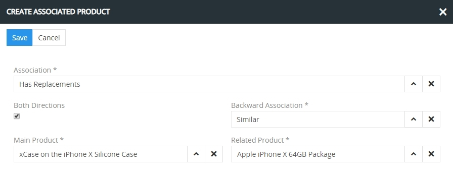

# Associated Products

**Associated Products** – two products, which are related within a certain association. So there is Main Product and Related Product. Related products are not automatically cross-linked, so if the product A (main product) is related to product B (associated product), it does not mean that product B is automatically related to product A. 

The option to create associated products targets on increasing sales and help in promotion and marketing of new products, but has a slightly different configuration process.

TreoPIM comes with the following predefined associations:

- **Up-sell products** are the products with higher price and quality, which could be more popular with shoppers and more profitable for the sellers. Up-sell products are generally packed with special features or other competitive advantages to encourage customers to change their mind and buy these ones. 

- **Cross-sell products** are complementary products, which could be bought in addition to the main one. Good examples are cases or a smartphone covers that can be offered to a shopper, who is buying a smartphone. These are the products the customer would probably also look for.

- **Related products** are usually products of the same category and type as the selected product or service. These are competitive alternatives to provide the customer with a wide number of options in addition to the main product. Sometimes related products are useful for promotion of less popular products or for attracting customers' attention to possible alternatives.

## Associated Products Fields

The "associated product" entity record comes with the following preconfigured fields; mandatory are marked with *:

| **Field Name**           | **Description**                   |
|--------------------------|-----------------------------------|
| Active                   | Activity state of the record      |
| Association *            | Association name within which the products are related           |
| Both directions          | Association direction type of the record: one- or two-way      |
| Backward association * *(if "Both directions" is enabled)*   | Backward association name         |
| Main product *           | The main product name |
| Related product *           | The related product name |

>If you want to make changes to the associated products entity, e.g. add new fields, or modify associated products views, please contact your administrator. 

## Associated Products' List View

To open the associated products' list view click the "Associated Products" in the navigation menu:

By default, the following associated products fields are displayed on the list view page for the associated products:

- Association
- Main product image
- Main product
- Related product image
- Related product

To sort associated products records, click any sortable column title; this will sort the column either ascending or descending.

Associated products can be searched and filtered according to your needs. For details on the search and filtering options, see the **Search and Filtering Panel** section of the [**User Interface**](https://treopim.com/help/user-interface#search-and-filtering-panel) article in this user guide.

To create a new associated products record, click the  button located in the upper right corner or the associated products list view page or  button on the "Associated products" panel of the product detail view page; a common entry creation pop-up window will open:

Here fill in all the required fields for the entry being created. Select the "Both directions" checkbox to make the association **two-way** – when product A is associated with product B; and vice versa, product B is associated with product A. Leave this checkbox unselected to make the association **one-way** – when product A is associated with product B, but not vice versa.

> If a [backward association](https://treopim.com/help/associations) is defined for the association entry within which the products are related, the "Both directions" checkbox will be selected by default with the backward association name displayed in the corresponding field. 

To edit the product association, use the "Edit" option from the single record actions drop-down list for the appropriate record. In the editing pop-up window that appears make changes in the desired fields, where possible. Click "Save" to apply your changes.

To remove the product association, select the "Remove" option from the single record actions drop-down list for the appropriate record.

To view the associated products record details, use the "View" option from the single record actions drop-down list for the appropriate entry on the "Associated Products" list view page. 

### Mass Actions

The following mass actions are available for associated products entities:
- Remove
- Mass update
- Export

For details on these actions, please, see the **Mass Actions** section of the [**User Interface**](https://treopim.com/help/user-interface#mass-actions) article in this user guide.

### Single Record Actions

The following single record actions are available for the associated products entities:
- View
- Edit
- Remove
  
For details on these actions, please, see the **Single Record Actions** section of the [**User Interface**](https://treopim.com/help/user-interface#single-record-actions) article in this user guide.

## Associated Product's Small Detail View

The "Associated Products" panel of the product detail view page displays which products are in relation with the currently opened product and within which association.

By default, the following fields are displayed in the associated product's small detail view:

- Related product image
- Related product
- Association
  
In this view you can create a new associated product via the  button and edit/remove the existing associated products records using the corresponding options of the single record actions drop-down list.

