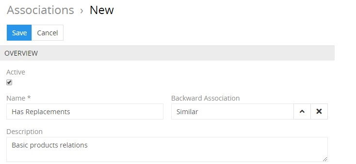

# Associations

**Association** – the type of the relationship between products, where one in some way is dependent on the other one(s), or can influence the other one(s) in accordance with different marketing strategies (e.g cross-sell, up-sell, etc.). Each product can associate different products and can be associated from different products.

Associations can be activated and deactivated. Deactivated associations cannot be used in the system, i.e. all records of the associated products will not be transferred via any channel.

## Association Fields

The association entity comes with the following preconfigured fields; mandatory are marked with *:

| **Field Name**           | **Description**                   |
|--------------------------|-----------------------------------|
| Active                   | Activity state of the record      |
| Name (multi-lang) *      | Association name, e.g. сross-sell |
| Backward association     | Backward association name         |
| Description (multi-lang) | The aim of this association usage |

> If you want to make changes to the association entity (e.g. add new fields, or modify association views), please contact your administrator.

## Associations' List View

To open the associations' list view, click the `Associations` option in the navigation menu:

By default, the following fields are displayed on the list view page for associations:
 - Name
 - Backward association
 - Active

To sort association records, click any sortable column title; this will sort the column either ascending or descending. 

Associations can be searched and filtered according to your needs. For details on the search and filtering options, see the **Search and Filtering Panel** section of the [**User Interface**](https://treopim.com/help/user-interface#search-and-filtering-panel) article in this user guide.

To create a new association record, click the `Create Association` button located in the upper right corner of the associations list view page.

To view some association record details, click the name field value of the corresponding record in the list of associations; the detail view page will open.

### Mass Actions

The following mass actions are available for association entities:
- Remove
- Mass update
- Export
- Add relation
- Remove relation

For details on these actions, please, see the **Mass Actions** section of the [**User Interface**](https://treopim.com/help/user-interface) article in this user guide.

### Single Record Actions

The following single record actions are available for association entities:
- View
- Edit
- Remove
  
For details on these actions, please, see the **Single Record Actions** section of the [**User Interface**](https://treopim.com/help/user-interface) article in this user guide.

## Association's Detail View

To view the association record and the records of the related entities, click the name of the desired association; the association's detail view page will be open.

### Association Creating / Editing

To create a new association, click the `Associations` option in the breadcrumb navigation or in the navigation menu to get to the association list view and then click the `Create Association` button. The common creation pop-up window will appear:

Here enter the association name and description (optional); activate the new association, if needed. Define its backward association using the corresponding select button. Click `Save` to finish the association creation or `Cancel` to abort the process.

> For more details on backward associations, please, refer to the [**Associated Products**](https://treopim.com/help/associated-products) article in this user guide.

Association editing is available in two ways:
- using the `Edit` button on the detail view page of the currently open association record;
- via the `Edit` option from the single record actions drop-down menu on the list view page.

Either way will open the editing pop-up window, where you can make any changes needed. 

### Removing the Association

To remove the association record, use the `Remove` option from the actions drop-down menu or from the single record actions drop-down list.

By default, it is not possible to remove the association, if there is any product associated with it.

### Duplicating the Association

Use the `Duplicate` option from the actions drop-down menu to go to the association creation page and get all the values of the last chosen association record copied in the empty fields of the new association record to be created.

## Working with Associated Products

[Associated products](https://treopim.com/help/associated-products) are related to the associations and are shown as a small list view on each product page.

By default, the following fields are displayed in the small detail view for associated products:
 - Related product image
 - Related product
 - Association

TreoPIM also offers you the ability to add associations to all the products (or as many as needed) simultaneously via the mass actions menu.

> For more details on the associated products and their features, please, refer to the [**Associated Products**](https://treopim.com/help/associated-products) article in this user guide.

