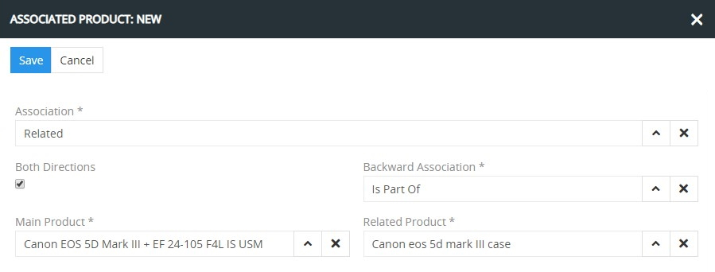
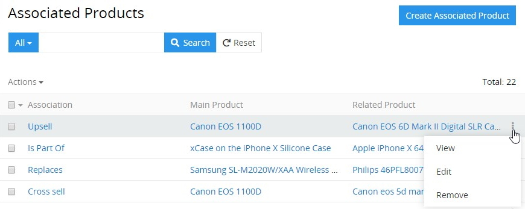
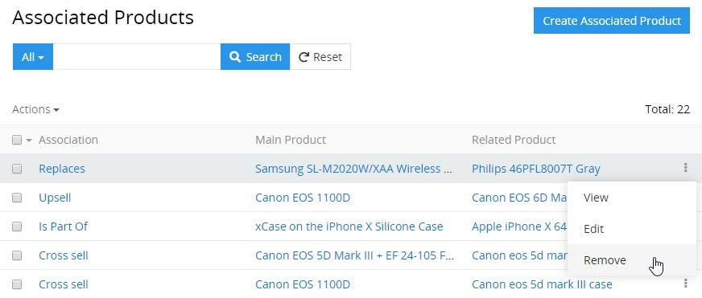

# Associated Products

**Associated Products** – two products, which are related within a certain association. So there is a *main product* and a *related product*. Related products are not automatically cross-linked, so if product A (main product) is related to product B (associated product), it does not mean that product B is automatically related to product A. 

The option to create associated products targets on increasing sales and helping in promotion and marketing of new products, but has a slightly different configuration process.

## Associated Product Fields

The `Associated Product` entity record comes with the following preconfigured fields; mandatory are marked with *:

| **Field Name**           | **Description**                   |
|--------------------------|-----------------------------------|
| Association *            | Association name within which the products are related           |
| Both directions          | Association direction type of the record: one- or two-way      |
| Backward association * *(if `Both directions` is enabled)*   | Backward association name         |
| Main product *           | The main product name |
| Related product *        | The related product name |

> If you want to make changes to the associated product entity, e.g. add new fields, or modify associated product views, please contact your administrator.

## Creating

To create a new associated product record, click `Associated Products` in the navigation menu to get to the associated products [list view](#listing), and then click the `Create Associated Product` button. The common creation  pop-up will appear:

Here fill in all the required fields for the entry being created. Select the `Both directions` checkbox to make the association **two-way** – when product A is associated with product B; and vice versa, product B is associated with product A. Leave this checkbox unselected to make the association **one-way** – when product A is associated with product B, but not vice versa.

> If a [backward association](./associations.md) is defined for the association entry within which the products are related, the `Both directions` checkbox will be selected by default with the backward association name displayed in the corresponding field.

Alternatively, use `+` button on the `ASSOCIATED PRODUCTS` panel of the [product](./products.md#associated-products) detail view page or the [quick create](./user-interface.md#quick-create) button on any KennerPim page and fill in the required fields in the associated product creation pop-up that appears. Please, note that the `ASSOCIATED PRODUCTS` panel of the product [detail view](./views-and-panels.md#detail-view) page displays which products are in relation with the currently opened product and within which association.

## Listing

To open the list of associated products available in the system, click `Associated Products` in the navigation menu:

By default, the following fields are displayed on the [list view](./views-and-panels.md#list-view) page for the associated product records:

- Association
- Main product
- Related product

Once the [TreoDAM module](https://treodam.com/) is installed, the `Main Product Image` and `Related Product Image` fields are also added to the associated products list view page:

> Learn more about TreoDAM [here](https://treodam.com/features).

To change the associated product records order in the list, click any sortable column title; this will sort the column either ascending or descending.

Associated products can be searched and filtered according to your needs. For details on these options, refer to the [**Search and Filtering**](./search-and-filtering.md) article in this user guide.

To view the associated product record details, use the `View` option from the single record actions menu for the appropriate entry on the "Associated Products" list view page. 

### Mass Actions

The following mass actions are available for associated product records:
- Remove
- Mass update
- Export

> If any option is missing in your mass actions menu, please, contact your administrator.

For details on these actions, please, see the [**Mass Actions**](./views-and-panels.md#mass-actions) section of the **Views and Panels** article in this user guide.

### Single Record Actions

The following single record actions are available for the associated product records:
- View
- Edit
- Remove

> If any option is missing in your single record actions menu, please, contact your administrator.

  
For details on these actions, please, refer to the [**Single Record Actions**](./views-and-panels.md#single-record-actions) section of the **Views and Panels** article in this user guide.

## Editing

To edit the associated product, use the `Edit` option from the single record actions menu for the appropriate record on the associated products list view page; the following editing pop-up will appear:

Here edit the desired fields and click the `Save` button to apply your changes.

Alternatively, make changes to the desired associated product record in the [quick edit](./views-and-panels.md#quick-edit-view) pop-up that appears when you select the `Edit` option from the single record actions menu on the `ASSOCIATED PRODUCTS` panel of the [product](./products.md#associated-products) detail view page. 

## Removing

To remove the associated product record, select the `Remove` option from the single record actions menu for the appropriate record on the `ASSOCIATED PRODUCTS` panel of the product detail view page 

or on the associated product records list view page:

The record removal operation has to be confirmed in the pop-up that appears:

