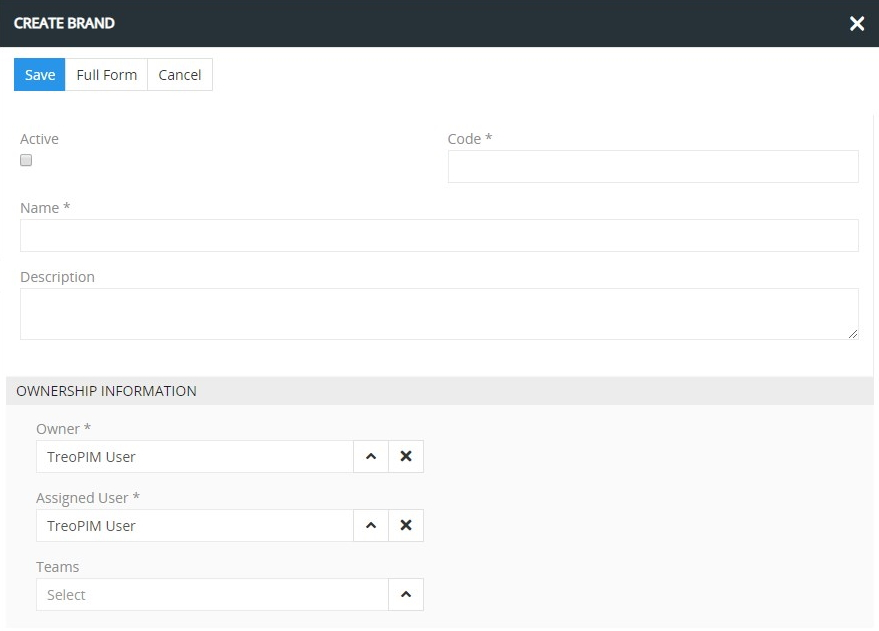
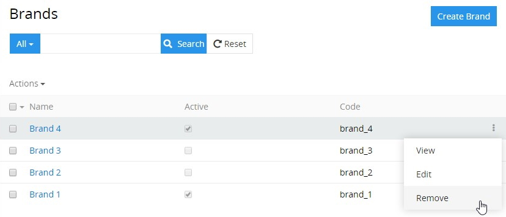
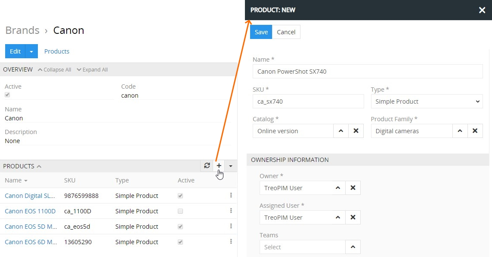

# Brands

**Brand** – a name, term, design, symbol, or other feature that distinguishes the product from its rivals in the eyes of the customer. Brands are used in business, marketing and advertising to increase sales. 

By default, only one brand can be assigned to the product. Brand is optional for the [product](https://treopim.com/help/products). It is technically possible to have different brands with same name, because of different IDs that would be assigned to them.

Brands can be activated or deactivated. Deactivated brands cannot be used in the system and are not transferred via any [channel](https://treopim.com/help/channels).

## Brand Fields

The brand entity comes with the following preconfigured fields; mandatory are marked with *:

| **Field Name**           | **Description**                            |
|--------------------------|--------------------------------------------|
| Active                   | Activity state of the brand record         |
| Name (multi-lang) *      | Brand name (e.g. Apple, Nike, etc.) |
| Code *                   | Unique value used to identify the brand. It can only consist of lowercase letters, digits and underscore symbols     |
| Description (multi-lang) | Description of the brand usage                   |

> If the [multi-languages](https://treopim.com/store/multi-languages#module-configuration) settings are activated, but multilingual fields are missing for the brand entity, or if you want to make changes to the brand entity (e.g. add new fields, or modify channel views), please, contact your administrator. 

## Creating

To create a new brand record, click `Brands` in the navigation menu to get to the brand records [list view](#listing), and then click the `Create Brand` button. The common creation window will open:

Here enter the desired name for the brand record being created and activate it, if needed. Its code is automatically generated based on the entered name, but you can change it via the keyboard. The brand description is an optional field and can be left empty.

Click the `Save` button to finish the brand record creation or `Cancel` to abort the process.

If the brand code is not unique, the error message will appear notifying you about it.

Alternatively, use the [quick create](./user-interface.md#quick-create) button on any TreoPIM page and fill in the required fields in the brand creation pop-up that appears:

## Listing

To open the list of brand records available in the system, click the `Brands` option in the navigation menu:

By default, the following fields are displayed on the [list view](./views-and-panels.md#list-view) page for brand records:
 - Name
 - Active
 - Code

To change the brand records order in the list, click any sortable column title; this will sort the column either ascending or descending. 

Brand records can be searched and filtered according to your needs. For details on these options, refer to the [**Search and Filtering**](./search-and-filtering.md) article in this user guide.

To view some brand record details, click the name field value of the corresponding record in the list of brands; the [detail view](./views-and-panels.md#detail-view) page will open showing the brand records and the records of the related entities. Alternatively, use the `View` option from the single record actions menu to open the [quick detail](./views-and-panels.md#quick-detail-view-small-detail-view) pop-up.

### Mass Actions

The following mass actions are available for brand records on the list view page:

- Remove
- Mass update
- Export
- Add relation
- Remove relation

> If any option is missing in your mass actions menu, please, contact your administrator.

For details on these actions, refer to the [**Mass Actions**](./views-and-panels.md#mass-actions) section of the **Views and Panels** article in this user guide.

### Single Record Actions

The following single record actions are available for brand records on the list view page:

- View
- Edit
- Remove

> If any option is missing in your single record actions menu, please, contact your administrator.

For details on these actions, please, refer to the [**Single Record Actions**](./views-and-panels.md#single-record-actions) section of the **Views and Panels** article in this user guide.

## Editing

To edit the brand, click the `Edit` button on the detail view page of the currently open brand record; the following editing window will open:

Here edit the desired fields and click the `Save` button to apply your changes.

Please, note that the locale fields appear when the ["Multi-Languages" module](https://treopim.com/store/multi-languages) is enabled and configured by the administrator.

Besides, you can make changes in the brand record via [in-line editing](./views-and-panels.md#in-line-editing) on its detail view page.

Alternatively, make changes to the desired brand record in the [quick edit](./views-and-panels.md#quick-edit-view) pop-up that appears when you select the `Edit` option from the single record actions menu on the brands list view page:

## Removing

To remove the brand record, use the `Remove` option from the actions menu on its detail view page

or from the single record actions menu on the brands list view page:

By default, it is not possible to remove the brand, if there is any product associated with it.

## Duplicating

Use the `Duplicate` option from the actions menu to go to the brand [creation page](#creating) and get all the values of the last chosen brand record copied in the empty fields of the new brand record to be created. Modifying the brand code is required, as this value has to be unique.

## Working With Products Related to Brands

Products that are linked to the brand are displayed on its [detail view](./views-and-panels.md#detail-view) page on the `PRODUCTS` panel and include the following table columns:
 - Name
 - SKU
 - Type
 - Active

> If this panel is missing, please, contact your administrator as to your access rights configuration. Also, to be able to relate more entities to brands, please, contact your administrator.

By design, if a brand record is deactivated, all the related products will automatically be deactivated as well. Otherwise, if a brand is activated, all the related products will remain in the previous activity state without any changes. To activate the products linked to this brand record, please, filter them by this brand and apply the corresponding [mass action](./views-and-panels.md#mass-actions).

To create a new product to be linked to the given brand record, use the `+` button located on the `PRODUCTS` panel and enter the necessary data in the product creation pop-up that appears:

To link the already existing products with the given brand record, use the `Select` option from the actions menu located in the upper right corner of the `PRODUCTS` panel. Then in the "Products" pop-up window choose one or several products you would like to assign to this brand record and click the `Select` button.

> Please, note that if the product has already been related to other brand record, it will be reassigned to a new brand, which is opened in the main window.

To see all products linked to the given brand record, use the `Show full list` option:

Then the "Products" page opens, where all product records [filtered](./search-and-filtering.md) by the given brand are displayed:

To view the brand related product, click its name in the products list or select the `View` option from the single record actions menu for the appropriate record:

To edit the brand related product record, use the `Edit` option from the single record actions menu for the appropriate record. In the editing pop-up window that appears make changes in the desired fields, where possible. Click the `Save` button to apply your changes.

Use the `Unlink` option from the single record actions menu to unlink the desired record from the brand and confirm your decision in the pop-up that appears:

To remove the product, select the `Remove` option from the single record actions drop-down list for the appropriate record.
