# Categories

**Category** – an efficient way to organize the [products](./products.md) by their type, which helps target consumer find the desired products faster. 

Categories make up a powerful tool that can be used not only to sort your content, but also to develop a proper, i.e. meaningful and semantic, structure of your product [catalog](./catalogs.md). Categories have a hierarchical taxonomy, meaning that there are parent and child categories. 

[**Category tree**](#category-tree) – the aggregate of all categories and parent–child relations among them. Category tree starts with a *root category* – a category, which has no parent category, and ends with many branches of categories without subcategories (i.e. *child categories*).

**Parent Category** – a category to which the category is assigned. If "Berlin" is a category, "Germany" may be its parent category.

**Subcategories** – all child categories, assigned to a certain category. Subcategories for category "Germany" may be "Berlin", "Munich", "Hannover" and so on.

There can be many category trees in KennerPim. Each category can have only one parent category. Each category may have a lot of subcategories. One category can be used in several category trees. Also many products can be assigned to one category, and each product can be assigned to more than one category in accordance with the catalog content.

## One Category Tree vs Multiple Category Trees

Each adopter of [KennerPim](./what-is-kennerpim.md) may decide for himself what works better for him – setting up and supporting multiple category trees or just one. Irregardless of the choice, it is still possible to synchronize different content for products you want to supply. 

## Category Fields

The category entity comes with the following preconfigured fields; mandatory are marked with *:

| **Field Name**           | **Description**                            |
|--------------------------|--------------------------------------------|
| Active                   | Activity state of the category record      |
| Name (multi-lang) *      | The category name							|
| Parent Category		   | The category to be used as a parent for this category |
| Code *                   | Unique value used to identify the category. It can only consist of lowercase letters, digits and underscore symbols				      |
| Description (multi-lang) | Description of the category usage                  |

> If the [multi-languages](https://treopim.com/store/multi-languages#module-configuration) settings are activated, but multilingual fields are missing for the category entity, or if you want to make changes to the category entity, e.g. add new fields, or modify product family views, please, contact your administrator.

## Creating

To create a new category record, click `Categories` in the navigation menu to get to the category records [list view](#listing), and then click the `Create Category` button. The common creation window will open:

Here enter the desired name for the category record being created and activate it, if needed. Its code is automatically generated based on the entered name, but you can change it via the keyboard. Click the select button in the `Parent category` field to assign one to the given category, if needed. The category description is an optional field and can be left empty.

Click the `Save` button to finish the category record creation or `Cancel` to abort the process.

If the category code is not unique, the error message will appear notifying you about it.

The new record will be added to the categories list. You can configure it right away on the [detail view](./views-and-panels.md#detail-view) page that opens or return to it later.

Alternatively, use the [quick create](./user-interface.md#quick-create)  button on any KennerPim page and fill in the required fields in the category creation pop-up that appears:

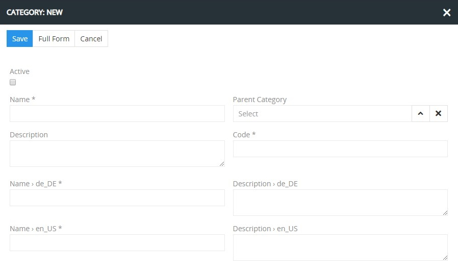

## Listing

To open the list of category records available in the system, click the `Categories` option in the navigation menu:

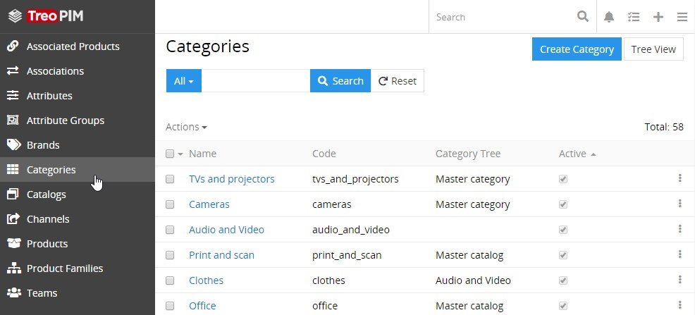

By default, the following fields are displayed on the [list view](./views-and-panels.md#list-view) page for category records:
 - Name
 - Code 
 - Category tree 
 - Active

To change the category records order in the list, click any sortable column title; this will sort the column either ascending or descending. 

Category records can be searched and filtered according to your needs. For details on these options, refer to the [**Search and Filtering**](./search-and-filtering.md) article in this user guide.

Once the [TreoDAM module](https://treodam.com/) is installed, the `Main Image` field is also added to category records on their list view page: 

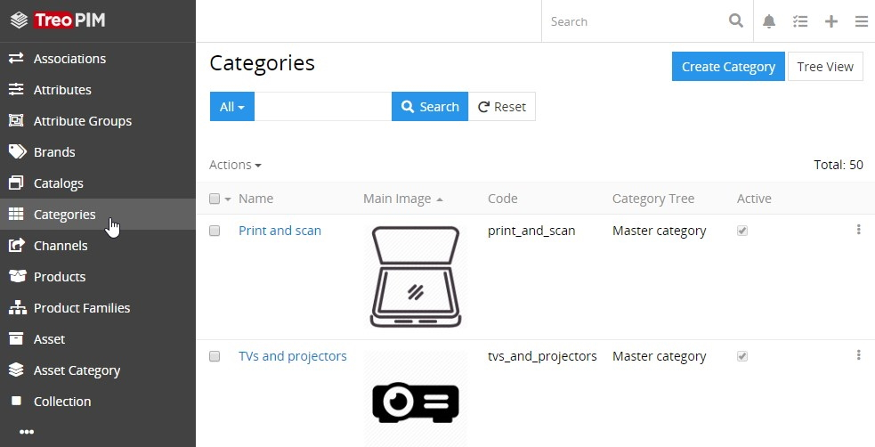

To view some category record details, click the name field value of the corresponding record in the list of categories; the [detail view](./views-and-panels.md#detail-view) page will open showing the category records and the records of the related entities. Alternatively, use the `View` option from the single record actions menu to open the [quick detail](./views-and-panels.md#quick-detail-view-small-detail-view) pop-up.

### Mass Actions

The following mass actions are available for category records on the list view page:

- Remove
- Mass update
- Export
- Add relation
- Remove relation

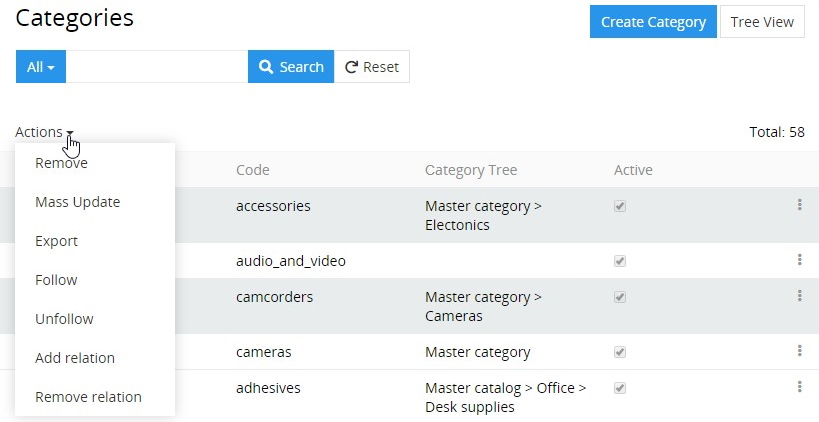

> If any option is missing in your mass actions menu, please, contact your administrator.

For details on these actions, refer to the [**Mass Actions**](./views-and-panels.md#mass-actions) section of the **Views and Panels** article in this user guide.

### Single Record Actions

The following single record actions are available for category records on the list view page:

- View
- Edit
- Remove

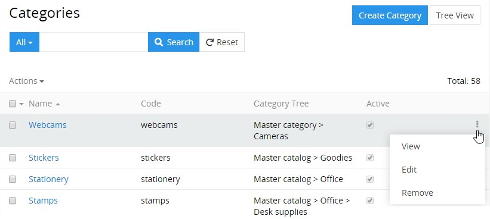

> If any option is missing in your single record actions menu, please, contact your administrator.

For details on these actions, please, refer to the [**Single Record Actions**](./views-and-panels.md#single-record-actions) section of the **Views and Panels** article in this user guide.

## Editing

To edit the category, click the `Edit` button on the detail view page of the currently open category record; the following editing window will open:

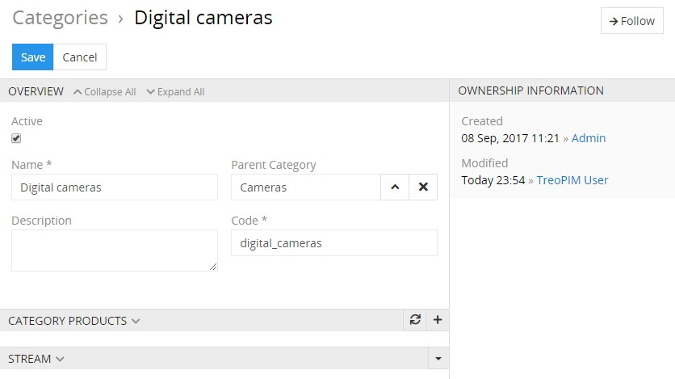

Here edit the desired fields and click the `Save` button to apply your changes.

Besides, you can make changes in the category record via [in-line editing](./views-and-panels.md#in-line-editing) on its detail view page.

Alternatively, make changes to the desired category record in the [quick edit](./views-and-panels.md#quick-edit-view) pop-up that appears when you select the `Edit` option from the single record actions menu on the categories list view page:

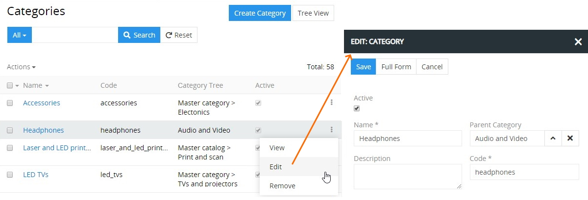

## Removing

To remove the category record, use the `Remove` option from the actions menu on its detail view page

or from the single record actions menu on the categories list view page:

The record removal operation has to be confirmed in the pop-up that appears:

By default, it is not possible to remove the category, if it has child categories in any [product](./products.md#product-categories) associated with it.

## Duplicating

Use the `Duplicate` option from the actions menu to go to the category creation page and get all the values of the last chosen category record copied in the empty fields of the new category record to be created. Modifying the category code is required, as this value has to be unique.

## Category Tree

KennerPim offers you a dynamic display of all categories available in the system in a tree view. To see this, click the `Tree View` button on the categories list view:   
           

In this view, parent–child relations are more explicit, and category trees are built (modified) via simple drag-and-drop of categories:

## Working With Entities Related to Categories

Relations to [products](./products.md#category-products) are available for all categories by default. For *root* categories, there is additionally the relation to [catalogs](#catalogs). Moreover, once the [TreoDAM module](https://treodam.com) is also installed in the KennerPim system, [assets](#asset-relations) can also be related to categories. All the related entities records are displayed on the corresponding panels on the category [detail view](./views-and-panels.md#detail-view) page. 

> If any panel is missing, please, contact your administrator as to your access rights configuration. To be able to relate more entities to categories, please, also contact your administrator.

### Category Products

[Products](./products.md) that are linked to the category record are shown on the `CATEGORY PRODUCTS` panel within the category [detail view](./views-and-panels.md#detail-view) page and include the following table columns:
 - Product
 - Scope
 - Channels

It is possible to link product records to a category by creating new category products. To do this for the currently open category record, click the `+` button located in the upper right corner of the `CATEGORY PRODUCTS` panel and enter the necessary data in the category product creation pop-up that appears:

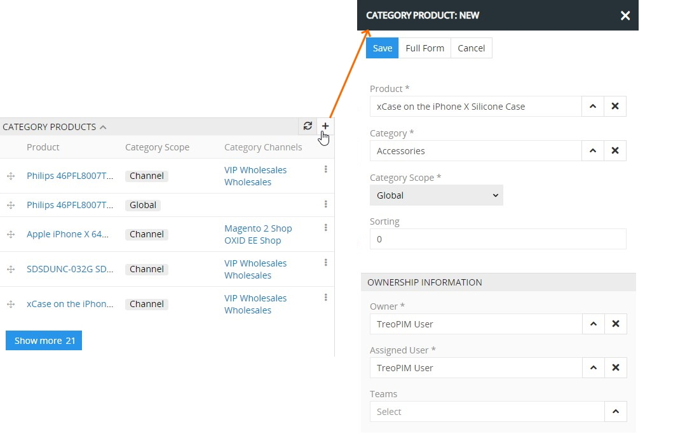

Fill in the `Sorting` field to define a certain sort order of the category product records on the panel, if needed. 

By default, the defined category has the `Global` scope, but you can change it to `Channel` and select the desired channel (or channels) in the added field:

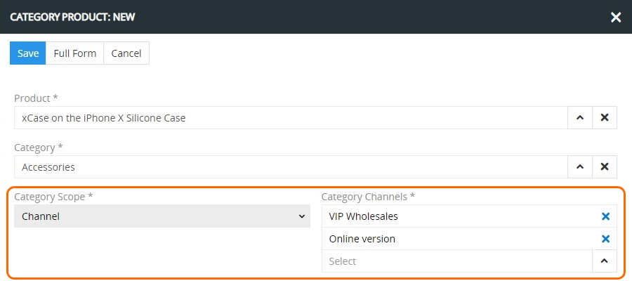

Click the `Save` button to complete the category creation process or `Cancel` to abort it.

It is possible to link the same category product twice, but with different category scopes – `Global` or `Channel`:

Please, note that you can link category products of both root and child categories. The only condition is that their root category should be linked to the same [catalog](./catalogs.md) to which the given product belongs.

Category product records can be viewed, edited, or removed via the corresponding options from the single record actions menu on the `CATEGORY PRODUCTS` panel:

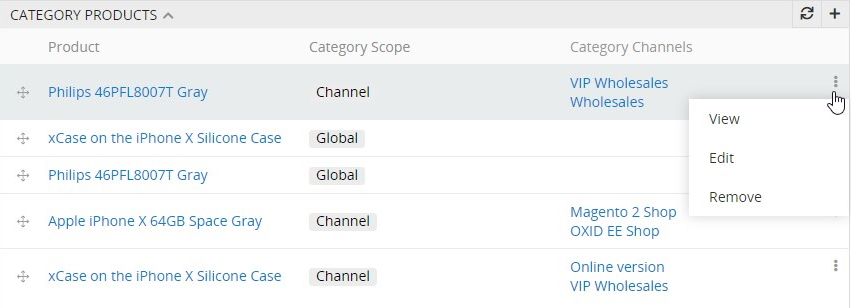

Moreover, category product records can be arranged in a certain order via their drag-and-drop on the `CATEGORY PRODUCTS` panel:

As a result, the records sorting value is changed accordingly.

### Catalogs

Root categories are also related to [catalogs](#catalogs) and the latter are displayed on the `CATALOGS` panel within the root category [detail view](./views-and-panels.md#detail-view) page and include the following table columns:
 - Name
 - Code
 - Categories
 - Active

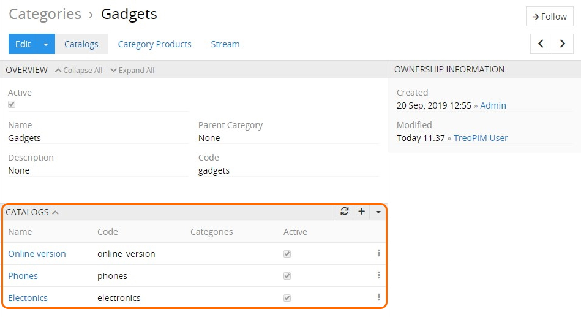

It is possible to link catalog records to the root category by selecting the existing ones or creating new catalogs. 

To create a new catalog record to be linked to the currently open root category, click the `+` button on the `CATALOGS` panel and enter the necessary data in the catalog creation pop-up that appears:

Click the `Save` button to complete the catalog creation process or `Cancel` to abort it.

To link the already existing catalog (or several catalogs) to the root category record, use the `Select` option from the actions menu located in the upper right corner of the `CATALOGS` panel:

In the "Catalogs" pop-up that appears, choose the desired catalog (or catalogs) from the list and press the `Select` button to link the item(s) to the root category.

Catalogs linked to the given category record can be viewed, edited, unlinked, or removed via the corresponding options from the single record actions menu on the `CATALOGS` panel:

### Asset Relations

> The `ASSET RELATIONS` panel is present on the category record detail view page only when the [TreoDAM module](https://treodam.com) is also installed in the KennerPim system.

All the assets that are linked to the currently open category record are displayed on its [detail view](./views-and-panels.md#detail-view) page on the `ASSET RELATIONS` panel and include the following table columns:
- Preview
- Name
- Related entity name
- Role
- Scope
- Channels

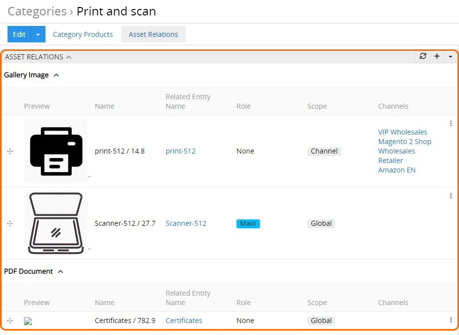

On this panel, you can link the following *asset types* to the given category record:
- Gallery image
- Description image
- Icon
- Office document
- Text
- CSV
- PDF document
- Archive

All the linked assets are grouped by type correspondingly.

To create a new asset record to be linked to the currently open category record, click the `+` button located in the upper right corner of the `ASSET RELATIONS` panel and enter the necessary data in the asset creation pop-up that appears:

Here select the asset type from the corresponding drop-down list and upload the desired file (or several files) via their drag-and-drop or using the `Choose files` button. Once the files are loaded, enter their data in the fields that appear:

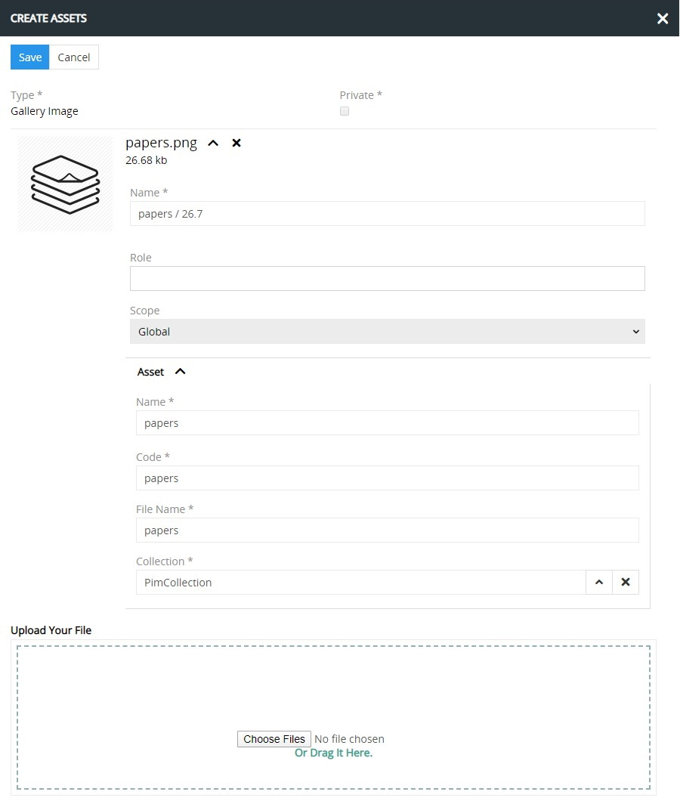

By default, the defined asset has the `Global` scope, but you can change it to `Channel` and select the desired channel (or channels) in the added field:

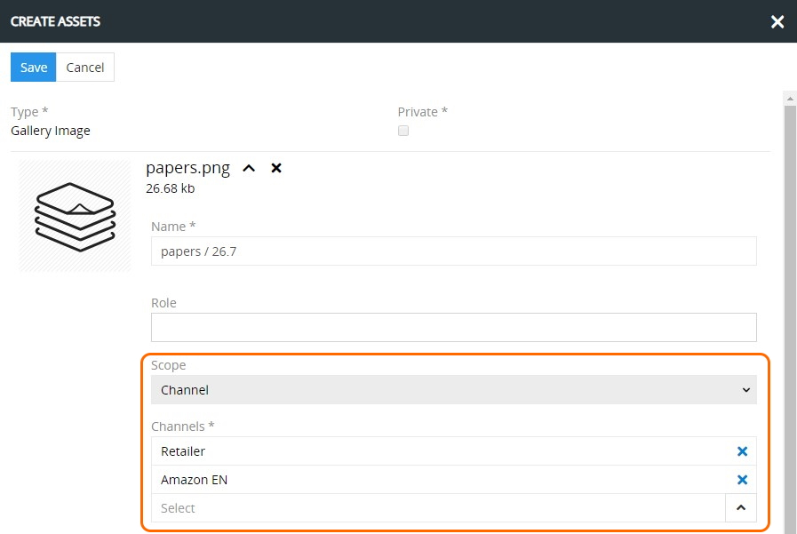

Select the `Private` checkbox to make the current asset record private, i.e. allow access to it only via the entry point. If the checkbox is not selected, KennerPim users can reach the asset via the direct shared link to its storage place.

Additionally, it is possible to assign a role to the asset record being created by clicking the corresponding field and selecting the desired option from the list:

By default, only the `Main` role is available, but the list can be expanded by the administrator. 

Click the `Save` button to complete the asset record creation process or `Cancel` to abort it.

Please, note that the **`Gallery image`** asset record of the **`Global`** scope *only* with the **`Main`** role assigned to it becomes the main image for the given category record and is displayed on the right hand side `CATEGORY PREVIEW` panel:

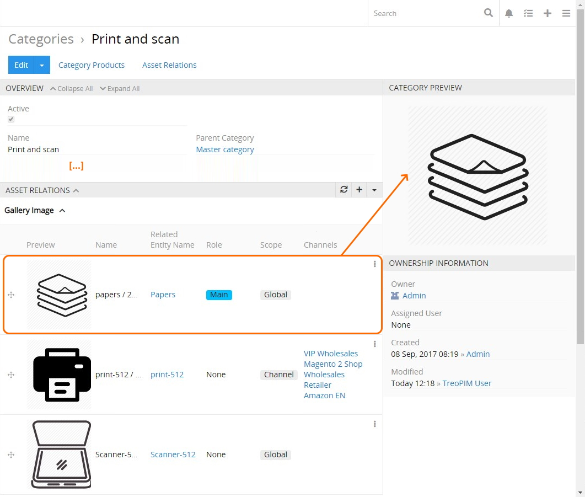

To view the main image in full size, click the category preview icon.

Once the `Main` role is assigned to a different `Gallery image` asset record of the `Global` scope, the `CATEGORY PREVIEW` panel content is automatically updated correspondingly. 

To assign an existing in the system asset (or several assets) to the category record, use the `Select` option from the actions menu located in the upper right corner of the `ASSET RELATIONS` panel:

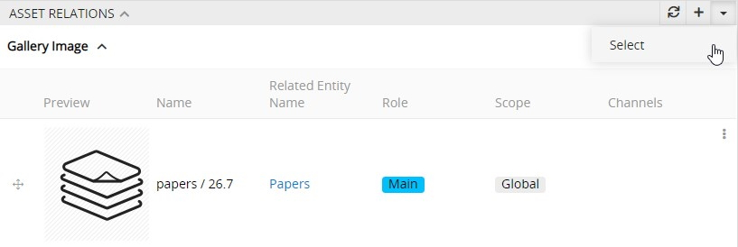

In the common record selection pop-up that appears, choose the desired assets from the list (they may be of different types) and press the `Select` button to link the item(s) to the category record.

Assets linked to the given category record, irregardless of their types, can be viewed, edited, or removed via the corresponding options from the single record actions menu on the `ASSET RELATIONS` panel:

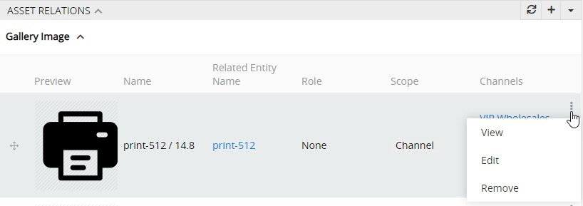

Here you can also define the sort order of the records within each asset type group via their drag-and-drop:

The changes are saved on the fly.

To view the category related asset record from the `ASSET RELATIONS` panel, click its name in the `Related entity name` column. The [detail view](./views-and-panels.md#detail-view) page of the given asset will open, where you can perform further actions according to your access rights, configured by the administrator. 
