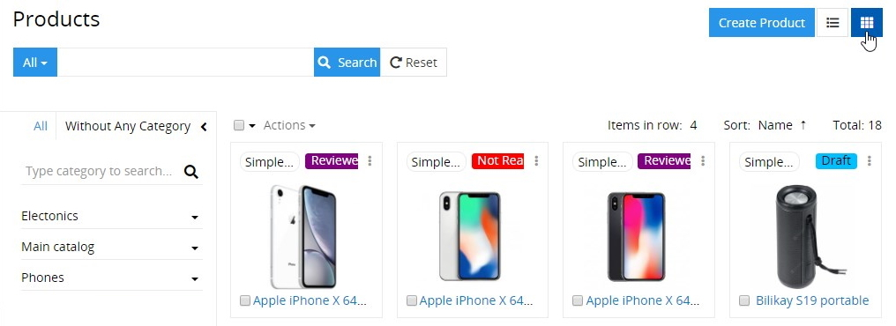
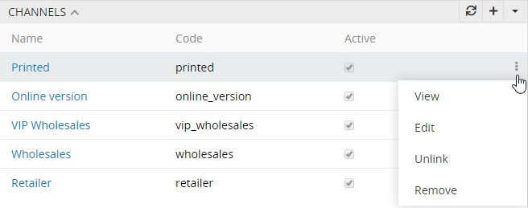
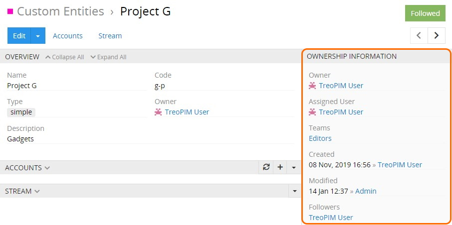

# Views and Panels

There are two types of **pages** in the TreoPIM system with the corresponding views:

- **List Page** – shows a table of records with main fields chosen for each entity and includes:
  - *[navigation menu](./user-interface.md#navigation-menu);*
  - *[taskbar](./user-interface.md#taskbar);*
  - *[search and filtering panel](./search-and-filtering.md);*
  - *[breadcrumb navigation](./user-interface.md#breadcrumb-navigation) including the page name;*
  - *records list in the [list](#list-view) or [plate](#plate-view) view.* 
- **Detail Page** – shows detailed information about the selected entity record and all its relations and includes:
  - *[navigation menu](./user-interface.md#navigation-menu);*
  - *[taskbar](./user-interface.md#taskbar);*
  - *[breadcrumb navigation](./user-interface.md#breadcrumb-navigation) including the page name;*
  - *[record details](#detail-view), where detailed information about the currently open entity record is displayed.* 

The **detail view** may also include:
- the *`OVERVIEW` panel* and some other panels, if these were configured by the administrator:

  

- several *small list views* for the related records, if these were configured by the administrator:
  
    

- *side view* with additional information concerning record management and activity stream, if activated for the entity.
  
Views can be shown in the main or pop-up window. They consist of the panels, which can be configured by the administrator. Usually these are structured in a way to provide you with key information through the record management.

## List View

The list view is shown in the main TreoPIM window and has its own layout, which can be configured by the administrator.

It is a default view to any entity that appears when selected in the navigation menu. Here the records belonging to this entity are displayed:

### Mass Actions

Mass actions are to be applied to several selected entity records, i.e. records with set checkboxes:

The following mass actions are available in the TreoPIM system: 
 
- **Remove** – to remove the selected entity records.
- **Merge** – to merge the selected entity records.
- **Mass update** – to update several selected entity records at once. To have a longer list of fields available for mass updating, please, contact your administrator.
- **Export** – to export the desired data fields of the selected entity records in the XLSX or CSV format.
- **Follow** – to enable tracking of the changes for the selected entity records. 
- **Unfollow** – to disable tracking of the changes for the selected entity records.
- **Add relation** – to relate the selected entity records with other entities (or entity).
- **Remove relation** – to remove the relations that have been added to the selected entity records.

To modify the mass actions list, please, contact your administrator.

*For more advanced export features, please, use the [**Export Feeds**](https://treopim.com/store/export-feeds) module.*

### Single Record Actions

To see the actions available for the records in the list, click the single record actions menu icon located on the right of the record:

By default, the following actions are available for all entities:
- **View** – to go to the detail view of the record.
- **Edit** – to go to the detail view of the record in the edit mode.
- **Remove** – to remove the selected record.

Please, contact your developer if you want to extend the single record actions list.

## Plate View

The plate view is a variant of the [list view](#list-view), in which all entity records are displayed as plates:

To switch to this view, click the plates icon located in the upper right corner of the list view page of entity records.

The [mass actions](#mass-actions) and [singe record actions](#single-record-actions)  are also available here, just like for the list view.

You can configure the plate view layout by selecting the desired item number to be displayed in a row (1–6) and defining the record field to be used for sorting via the corresponding drop-down menus:

Within the TreoPIM system the plate view is available only for [products](./products.md).

## Detail View

The detail view is shown in the main window and has its own layout, which can be configured by the administrator:

You can start following the entity record right on the detail view page. To do this, click the `Follow` button, placed in the upper right corner of your detail view page. It will turn into `Followed`. Click this button again to stop following the entity record.

*This option is available only when the `Stream` checkbox is activated for the given entity by the administrator in the Entity Manager.*

[Filtering](./search-and-filtering.md) the record data display by fields, locales, and scopes is available on the [products](./products.md) detail view page only via the corresponding drop-down menus:

Keep in mind that the locales filter appears when the "Multi-Languages" module is installed and input language options are configured by your administrator. Go to our [store](https://treopim.com/store/multi-languages) to learn more about the "Multi-Languages" module and its features.

Navigation through the existing entity records can be done on the detail view pages using the corresponding buttons: 

To edit the fields data on the detail view page, use [in-line editing](#in-line-editing).

### Main Actions

The following actions are available for all entity records by default:

- **Edit** – click the `Edit` button to make changes in the given record.
- **Remove** – select the `Remove` option from the actions drop-down menu to remove the given record.
- **Duplicate** – select the `Duplicate` option from the actions drop-down menu to go to the record creation page and enter the unique values for the record fields to be used for duplication. 

## Small List Views

Small list views are panels and pop-up windows with data on the entities related to the given entity record, shown in the main window always together with the detail view. Each entity may have as many related entities as needed.

The following actions are available for the small list view panels:
- **General actions** – applicable to all records on the related entities panel:
  
  - *Refresh* – to refresh the related entities list on the panel;
  - *Create* – to create a new record for the related entity;
  - *Select* – to create a relation between the entity record, which is opened in the main window and the entity record, which was chosen in the pop-up window. 
  
*Please, keep in mind that choosing some record in the pop-up window will reassign this record to the entity record, which is opened in the main window. The previous relation will be dropped, if the relation is one-to-many retrospectively.*

- **Single record actions** – applicable to each record of the related entities separately. The list of actions here is usually the same as on the list view for this entity.
    

## Side View

The side view panel is used to show additional information and is shown in the main window always together with the detail view panels:

The following information is available by default on the side view panel:
 - **Owner** – who is currently responsible for the record; the value is changeable.
 - **Assigned User** – who should work on the record; the value is changeable.
 - **Teams** – which team(s) can have access to this record; values are changeable.
 - **Created** – the date and time of the record creation, as well as its author; not changeable.
 - **Modified** – the date and time of the record modification, not changeable.
 - **Followers** – who is following the changes in the record.

The `Owner`, `Assigned user`, and `Teams` fields are enabled/disabled by the administrator.

TreoPIM modules can add more panels to the side view panel. Please, visit our [store](https://treopim.com/store) to learn more about TreoPIM modules available for you.

## Edit View

The edit view panel is shown in the main window and uses the layout of the detail view page. To get to it, use the `Edit` button on the detail view page:

 On the `OVERVIEW` panel you can edit only the fields of the given entity, i.e. no fields of the related entities can be edited here.

If you are on the quick edit view page, click the `Full Form` button to get to the edit view page.

## Create View

To get to the create view page, click the `+` button on the list view page (or in the main window) and fill in the record fields. Click the `Save` button to complete the record creation or `Cancel` to abort the operation.

Using the global `Create 'Entity'` button from the list view page brings you to the create view page. In all other cases, you will be taken to the quick create view page that will be opened in a pop-up window.

## Quick Detail View (Small Detail View)

The quick detail view is shown in a pop-up window. It is usually used to display the record details for some related entity or after using the single record action on the list view page.

## Quick Edit View

The quick edit view is shown in a pop-up window and uses the layout of the small detail view page. It is usually used to edit records for the related entities or to edit records after using the single record action on the [list view](#list-view) page.

Click the `Full Form` button to get to the [edit view](#edit-view) page.

## Quick Create View

The quick create view is shown in a pop-up window and uses the layout of the small detail view page. It is usually used to create records for the related entities.

Click the `Full Form` button to get to the [create view](#create-view) page.

## Entity Records

Each entity in the system can have many records. These records are available to work with on the views described above. 

The following actions are available directly out of the box:

| **Actions** | **Available on Views**                                      |
|-------------|-------------------------------------------------------------|
| View        | Detail View, Quick View, List View                          |
| Create      | Create View, Quick Create View                              |
| Edit        | Edit View, Quick Edit View, Detail View via in-line editing |
| Remove      | List, View, Detail View                                     |
| Merge       | List View                                                   |
| Export      | List View                                                   |

If you want to make changes to some entity (e.g. add new fields, modify its views or relations), please, contact your administrator.

### In-Line Editing

With in-line editing you can change values *on the fly*. This ensures quick change of field values and reduces the number of clicks to do their work.

Currently in-line editing is available on the [detail view](#detail-view) pages only. To edit the record information on these pages using the in-line editing, click the pencil icon located in the upper right corner of the field you want to edit:

### Automatic Linking of the Related Entity Records

Each entity in the system has a certain main naming field, in most cases this is the `Name` field. These field values are automatically converted to links, leading to the detail view pages of the appropriate entity record.
